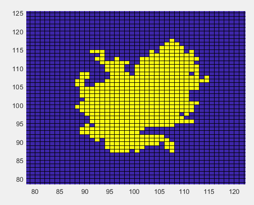
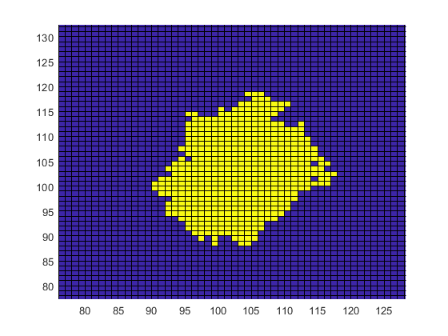
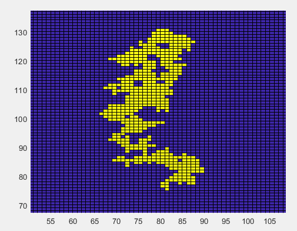

# MATLAB-Utils
Utilities for MATLAB

# ContinentMap
Generates random tile maps that resemble continents

obj = ContinentMap.generate(500, -100, 60, -60, 100, 0.3, 2);
obj.plot();

obj = ContinentMap.generate(500, -100, 100, -100, 100, 0.9, 2);
obj.plot();

ContinentMap.generate(500, -100, 100, -100, 100, 0.01, 10);
obj.plot();

